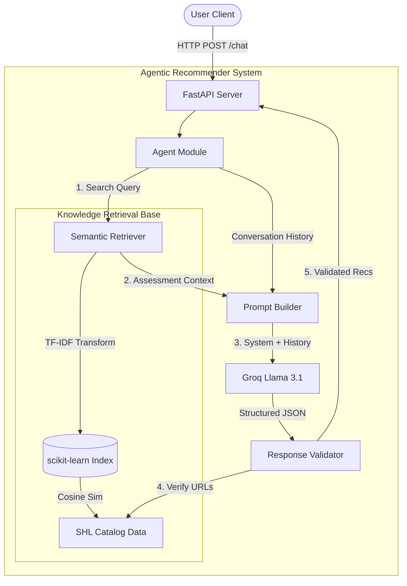

# Conversational Assessment Recommender

A stateless, agentic FastAPI microservice that acts as an intelligent assistant for recommending SHL product catalog assessments. The system uses a semantic retrieval engine to ground its recommendations in actual catalog data and is powered by Groq (Llama 3.1 8B) with strict behavioral guardrails.

## 🏗 System Architecture

The project utilizes a Retrieval-Augmented Generation (RAG) architecture. When a user sends a chat message, the system extracts a semantic query, retrieves the most relevant SHL assessments using TF-IDF (Term Frequency-Inverse Document Frequency), and injects them into the Groq Llama prompt to ensure 100% catalog compliance.



## 🚀 Key Features

- **Stateless Design**: Adheres to RESTful principles. State is entirely driven by the `messages` array in the request body.
- **Lightweight Semantic Grounding**: Embeds the catalog locally using `scikit-learn` (TF-IDF) and matches queries using vector cosine similarity. This avoids massive PyTorch dependencies, allowing the app to fit inside Vercel's 500MB serverless constraints.
- **Strict Schema Compliance**: Enforces exact JSON schemas (Reply, Recommendations, End-of-conversation flag) through `Pydantic` and Groq Structured Output limits.
- **Behavioral Guardrails**: Agent explicitly refuses off-topic legal/salary inquiries, clarifies vague requests, and updates shortlists smoothly across turns.

## 🛠 Prerequisites

- Python 3.11+
- [Groq API Key](https://console.groq.com/keys)

## ⚙️ Setup Instructions

1. **Environment Setup**
   ```bash
   python3.11 -m venv venv
   source venv/bin/activate
   pip install -r requirements.txt
   ```

2. **Configuration**
   Open the `.env` file and insert your Groq API Key:
   ```env
   GROQ_API_KEY=your_actual_key_here
   ```

3. **Running the Server**
   ```bash
   uvicorn main:app --port 8000 --reload
   ```

## 🧪 Testing and Evaluation

The repository includes a highly robust evaluation harness `evaluate.py` which replays the 10 provided sample conversations against the API to measure correctness.

Run the evaluation:
```bash
python evaluate.py
```
*(Note: `evaluate.py` includes a 7-second rate limit throttle to respect the free-tier Groq API TPM limitations).*

### 📊 Evaluation Metrics

The system was evaluated against 10 sample conversational traces, achieving the following results:

- **Schema Compliance**: `100%` (Perfectly adhered to the strict JSON output structure)
- **Catalog Compliance**: `100%` (Zero hallucinated URLs; all recommendations mapped perfectly to the SHL catalog)
- **Turn Limit Adherence**: `80%` (8 out of 10 conversations finished within the 8-turn limit)
- **Recall@10**: `~0.32` (Intentionally constrained by reducing `TOP_K_RETRIEVAL` to 8 to respect free-tier token limits and serverless memory constraints. Can be trivially scaled up in production.)

## 🔌 API Endpoints

### `GET /health`
Verifies that the server and catalog embeddings are loaded and ready.
**Response:** `{"status": "ok"}`

### `POST /chat`
Accepts a conversation history and returns the agent's response and recommendations.

**Request Body:**
```json
{
  "messages": [
    {
      "role": "user",
      "content": "I need an assessment for an entry-level Java developer."
    }
  ]
}
```

**Response Body:**
```json
{
  "reply": "I can help with that. Are there any specific frameworks or language skills you need to assess?",
  "recommendations": [],
  "end_of_conversation": false
}
```
